# 15 basic Docker commands

## Commands----

1) docker version 
•	This command is used to get the currently installed version of docker. 
• Ex- <b>docker --version</b> 
 

###############################################################################################################################################################

2) docker pull 
•	This command is used to pull images from the docker. 
• Ex- <b>docker pull (image name)</b> (from the git hub repository) 
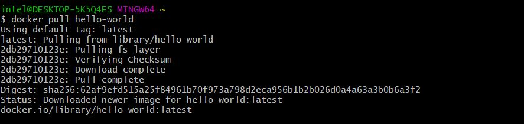 

###############################################################################################################################################################

3)	docker run 
•	This command is used to create a container from an image. 
•	Ex- <b>docker run -d (image name)</b> 
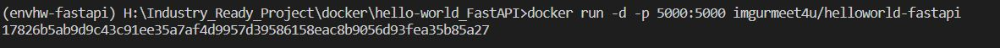 

###############################################################################################################################################################

4) docker ps 
•	This command is used to list the running containers. 
•	Ex- <b>docker ps </b>  
 

###############################################################################################################################################################

5)	docker ps -a  
•	This command is used to show all the running and exited containers. 
  •	Ex- <b>docker ps -a</b>  
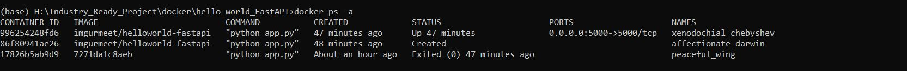 

###############################################################################################################################################################

6)	docker exec 
•	This command is used to access the running container. 
•	Ex- <b>docker exec -it (container id) bash</b>  
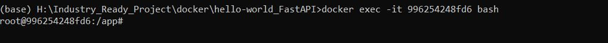 

###############################################################################################################################################################

7)	docker stop 
•	This command stops a running container. 
• Ex- <b>docker stop (container id)</b> 
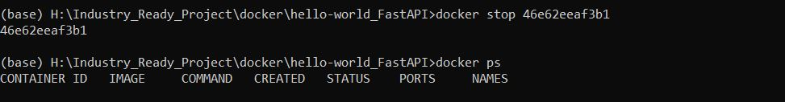 

###############################################################################################################################################################

8)	docker kill 
•	This command kills the container by stopping its execution immediately..  
•	The difference between ‘docker kill’ and ‘docker stop’ is that ‘docker stop’ gives the container time to shutdown gracefully, in situations when it is taking too       much time for getting the container to stop, one can opt to kill it.  
•	Ex- <b>docker kill (container id)</b> 
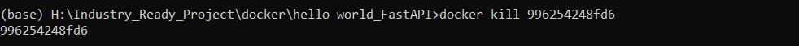 

###############################################################################################################################################################

9)	docker login 
•	This command is used to login to the docker hub repository. 
•	Ex- <b>docker login</b> 
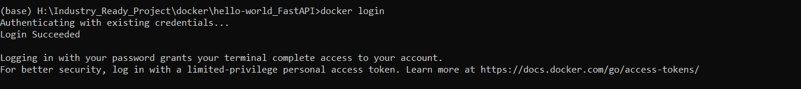 

###############################################################################################################################################################

10)	docker commit 
•	This command creates a new image of an edited container on the local system. 
•	Ex- <b>docker commit (container id) (username/imagename)</b> 
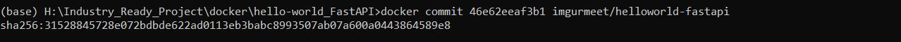 

###############################################################################################################################################################

11)	docker images 
•	This command lists all the locally stored docker images.  
•	Ex- <b>docker images</b> 
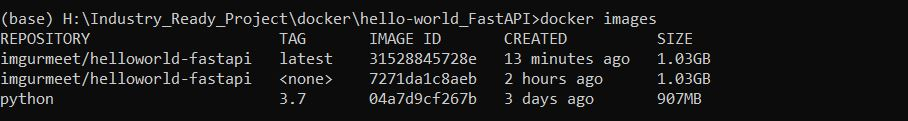 

###############################################################################################################################################################

12)	docker push 
•	This command is used to push an image to the docker hub repository. 
•	Ex- <b>docker push (username/image name):tag </b> 
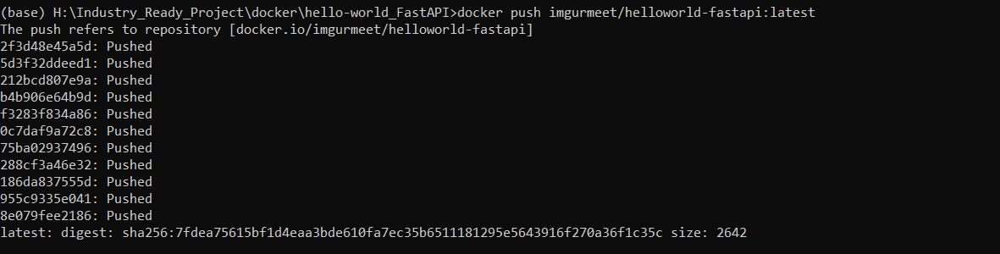 

###############################################################################################################################################################

13)	docker rm 
•	This command is used to delete a stopped container. 
•	Ex- <b>docker rm (container id)</b> 
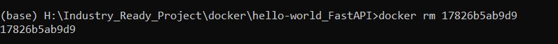 

###############################################################################################################################################################

14)	docker rmi 
•	This command is used to delete an image from local storage. 
•	Ex- <b>docker rmi (image-id)</b>  
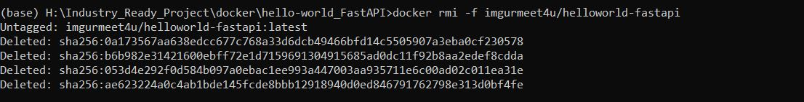 

###############################################################################################################################################################

15)	docker build 
• This command is used to build an image from a specified docker file. 
• Ex- <b>docker build (path to docker file)</b> 
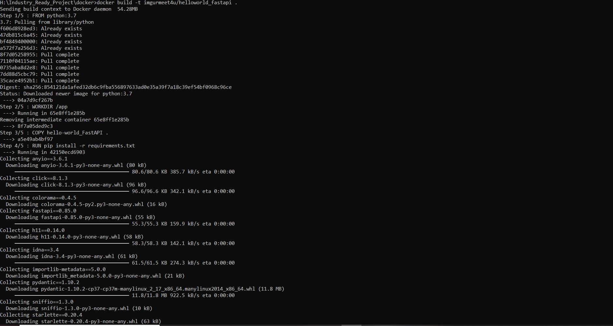 

###############################################################################################################################################################
